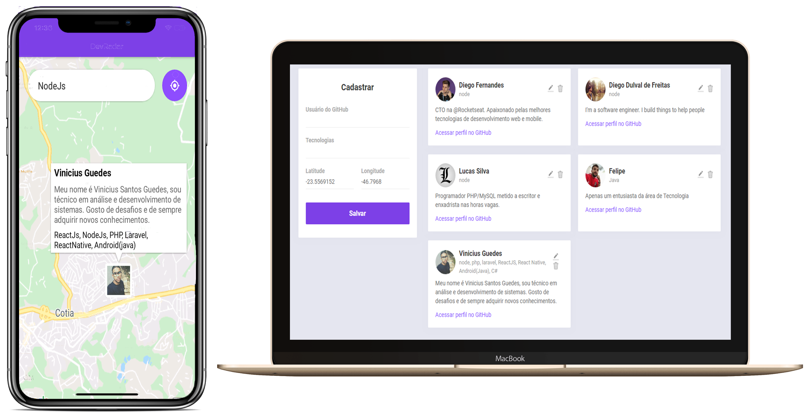

 # DevRadar-Semana-Omnistack-10
> Na semana Omnistack, criei um radar de desenvolvedores

<p align="center">
  <a aria-label="Versão do Node" href="https://github.com/nodejs/node/blob/master/doc/changelogs/CHANGELOG_V12.md#12.14.1">
    </img>
  </a>
  <a aria-label="Versão do React" href="https://github.com/facebook/react/blob/master/CHANGELOG.md#16120-november-14-2019">
    </img>
  </a>
  <a aria-label="Versão do Expo" href="https://www.npmjs.com/package/expo-cli/v/3.11.5">
    </img>
  </a>
</p>

Esse projeto localiza os desenvolvedor que estão perto de você, tendo a opção de perquisar por tecnologias especificas e também acessar o GitHub da pessoa


## Instalação
Configure o MongoDB e atualize a string de conexão(stringdb) no arquivo `backend\src\index.js`. Agora execute os seguintes comando para instalar:
```bash
cd backend
yarn install
yarn nodemon src/index.js
```
Para iniciar o frontend, basta usar os comandos a seguir. O servidor será iniciado na porta 3000(localhost:3000)
```bash
cd frontend
yarn install
yarn start
```

Para iniciar o mobile, você terá que atualizar o ip da sua máquina no arquivo `src/services/api.js`, e depois execute os comandos abaixo:
```bash
yarn global add install expo-cli             #caso já tenha o expo instalado no seu pc, não use esse comando
cd mobile
yarn install
yarn start
```

## Como usar



**Web:**
Na versão web, é posível cadastrar um novo desenvolvedor na aplicação e também editar e excluir

**Mobile:**
Na parte mobile, você podera pesquisar por desenvolvedores que estão em um raio de 10km de sua localização, e também ver o github do mesmo, diretamente do aplicativo


## Licença

[MIT](./LICENSE) &copy; [Rocketseat](https://rocketseat.com.br/)
